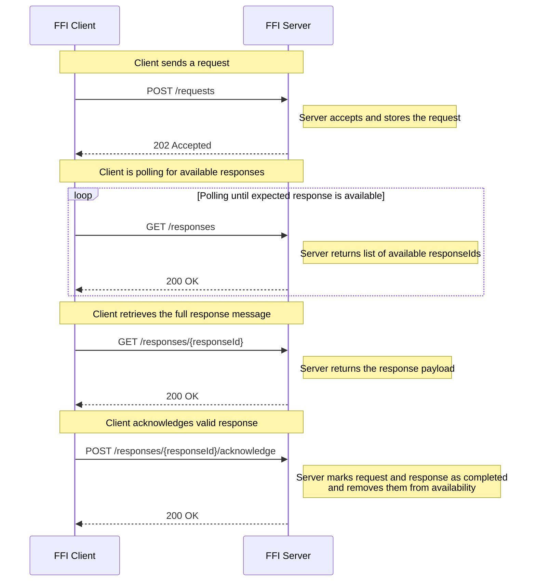

## Getting Started – Using the FFI APIs

This guide explains how to use the FFI APIs depending on your role in the infrastructure:

- The **Contract API** – Retrieve your bilateral contract  
- The **Core API** – Send, receive, and acknowledge messages  
- The **Conventions** – Ensure consistency, validation, security and compliance (see [Required Conventions](#required-conventions))

All usage is governed by BSAB. See [LICENSE.md](./LICENSE.md) for terms.

---

## Two Roles: Requestor (Client) and Respondent (Server)

Each participating entity acts either as:

- **FFI Requestor (Client)** – initiates message-based communication  
- **FFI Respondent (Server)** – receives and processes requests, returns responses  

💡 Depending on the federation, an entity may need to implement **both roles**.

---

## Scenario: Acting as a Client (FFI Requestor)

As a Requestor, your system must:  
1. Retrieve the contract  
2. Submit a request  
3. Poll for the corresponding response  
4. Acknowledge receipt

👉 See [The Happy Flow – Request to Response Acknowledgment](#the-happy-flow--request-to-response-acknowledgment) for step-by-step details including headers, payloads, and conventions.

---

## Scenario: Acting as a Server (FFI Respondent)

As a Respondent, your system must:  
1. Expose the Contract API  
2. Accept and validate incoming requests  
3. Provide responses  
4. Receive acknowledgments

👉 See [Required Conventions](#required-conventions) for responsibilities on schema validation, security, and availability handling.

---

## About the Version Placeholders

The `<core-api-major-version>` and `<contract-api-major-version>` parts in the URLs are **placeholders** for the actual **major versions** of each respective API.  

Each federation or provider is responsible for exposing the correct version(s), according to the [Versioning Convention](./conventions/handling-parallel-major-versions.md).

---

## Required Conventions

| Area              | Convention |
|-------------------|------------|
| Security & Auth   | [handling-api-security.md](./conventions/handling-api-security.md) |
| Schema validation | [handling-schema-validation.md](./conventions/handling-schema-validation.md) |
| Versioning rules  | [handling-parallel-major-versions.md](./conventions/handling-parallel-major-versions.md) |
| Polling & retry   | [handling-response-polling.md](./conventions/handling-response-polling.md) |
| Compression       | [handling-compression-and-large-responses.md](./conventions/handling-compression-and-large-responses.md) |
| Connectivity check| [handling-connectivity-check.md](./conventions/handling-connectivity-check.md) |

---

## The Happy Flow – Request to Response Acknowledgment

This section describes the typical end-to-end flow for the FFI Core API, from sending a request to acknowledging the response. Each step includes required headers, payload expectations, and behavioral outcomes.

FFI-specific headers are defined and governed by FFI conventions, while standard HTTP headers (like `Authorization` or `Accept-Encoding`) follow standard protocols.

### Sequence Diagram – Client Flow

### POST /requests – Send a Request

- Requires: `X-FFI-MessageType`, `X-FFI-MessageTypeSchemaVersion`  
- Auth: OAuth2 access token   
- Body: JSON or XML payload matching the declared schema  
- Response: `202 Accepted` with tracking headers

📘 See: [Schema Validation Convention](./conventions/handling-schema-validation.md)

---

### GET /responses – Poll for Responses

- Auth: OAuth2 access token   
- Response: List of available responseIds with metadata  
- Constrained by polling rules

📘 See: [Polling Convention](./conventions/handling-response-polling.md)

---

### GET /responses/{responseId} – Retrieve the Response

- Auth: OAuth2 access token   
- Optional header: `Accept-Encoding: gzip`  
- Response schema depends on `X-FFI-ProcessingResult`
    - If `SUCCESS`, the payload conforms to the *success schema* for the message type.
    - If `ERROR`, the payload conforms to the *error schema* for that message type.

📘 See: [Schema Validation Convention](./conventions/handling-schema-validation.md)

---

### POST /responses/{responseId}/acknowledge – Confirm Receipt

- Header: `X-FFI-AcknowledgeStatus: SUCCEEDED | FAILED`  
- Auth: OAuth2 access token   
- Marks message and request as completed and no longer retrievable

---

## Implementation Guidance

- Use the `ffi-core.yaml` and `ffi-contract.yaml` OpenAPI files  
- Follow conventions under `/conventions/`  
- Implement security according to [handling-api-security.md](./conventions/handling-api-security.md)  
- Monitor releases and version updates

---

© 2025 BSAB – All rights reserved.