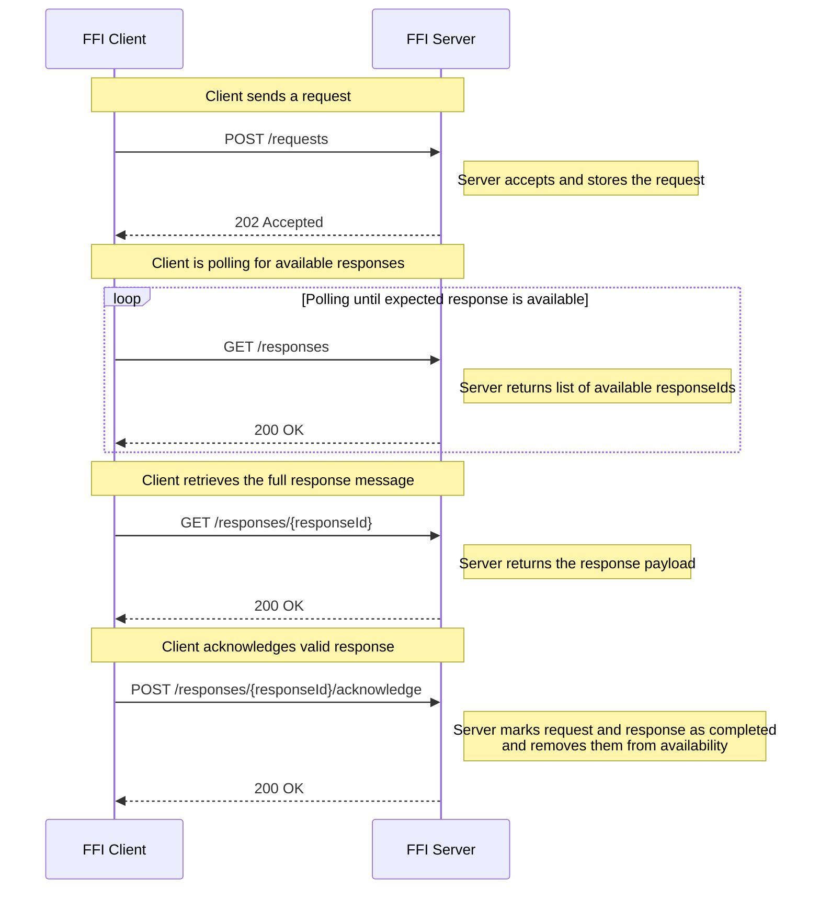

# Getting Started – Using the FFI APIs

This guide explains how to use the FFI APIs depending on your role in the infrastructure:

- The **Contract API** – Retrieve your bilateral contract
- The **Core API** – Send, receive, and acknowledge messages
- The **Conventions** – Ensure consistency, validation, security and compliance

All usage is governed by BSAB. See [LICENSE.md](./LICENSE.md) for terms.

## Two Roles: Requestor (Client) and Respondent (Server)

Each participating entity acts either as:

- **FFI Requestor (Client)** – initiates message-based communication
- **FFI Respondent (Server)** – receives and processes requests, returns responses

💡 Depending on the federation, an entity may need to implement **both roles**.

## Scenario: Acting as a Client (FFI Requestor)

### 1. Retrieve your contract

`GET /<contract-api-major-version>/contract` (Contract API)

- Returns your active **bilateral contract**
- Lists allowed `messageTypes`, `schemaVersions`, and partner contact info
- Provides the `contractId` implicitly used in Core API calls

### 2. Send a request

`POST /<core-api-major-version>/requests` (Core API)

**Headers:**
- `X-FFI-MessageType`
- `X-FFI-MessageTypeSchemaVersion`

**Body:**
- Message payload (JSON or XML)

**Authentication:**
- You must obtain an OAuth 2.0 access token using **Mutual TLS (mTLS)** or **Private Key JWT**
- The token must include an appropriate `scope` (e.g. `ffi-core`)
- Your TLS certificate must be issued and bound per [handling-api-security.md](./conventions/handling-api-security.md)

### 3. Poll for a response

- `GET /<core-api-major-version>/responses`
- `GET /<core-api-major-version>/responses/{responseId}`

### 4. Acknowledge the response

`POST /<core-api-major-version>/responses/{responseId}/acknowledge`

## Scenario: Acting as a Server (FFI Respondent)

### 1. Expose the Contract API

`GET /<contract-api-major-version>/contract`

- Must return the contract for the authenticated caller
- Includes `messageTypes`, schema versions, and partner info

### 2. Accept and process requests

`POST /<core-api-major-version>/requests`

- Validate the `messageType`, schema version, and contract context
- Store `requestId`, route internally for processing

### 3. Make response available

- `GET /<core-api-major-version>/responses`
- `GET /<core-api-major-version>/responses/{responseId}`

### 4. Receive acknowledgment

`POST /<core-api-major-version>/responses/{responseId}/acknowledge`

**Authentication:**
- Your API endpoints must be protected using **OAuth 2.0 with MTLS or Private Key JWT**
- You must issue and trust **X.509 TLS client certificates** from authorized participants
- TLS server certificate must be issued by a public CA ([handling-api-security.md](./conventions/handling-api-security.md))

## About the Version Placeholders

The `<core-api-major-version>` and `<contract-api-major-version>` parts in the URLs are **placeholders** for the actual **major versions** of each respective API.  

Each federation or provider is responsible for exposing the correct version(s), according to the [Versioning Convention](./conventions/handling-parallel-major-versions.md).

## Required Conventions

| Area              | Convention |
|-------------------|------------|
| Security & Auth   | [handling-api-security.md](./conventions/handling-api-security.md) |
| Schema validation | [handling-schema-validation.md](./conventions/handling-schema-validation.md) |
| Versioning rules  | [handling-parallel-major-versions.md](./conventions/handling-parallel-major-versions.md) |
| Polling & retry   | [handling-response-polling.md](./conventions/handling-response-polling.md) |
| Compression       | [handling-compression-and-large-responses.md](./conventions/handling-compression-and-large-responses.md) |
| Connectivity check| [handling-connectivity-check.md](./conventions/handling-connectivity-check.md) |

## The Happy Flow – Request to Response Acknowledgment

This section describes the typical end-to-end flow for the FFI Core API, from sending a request to acknowledging the response. Each step includes required headers, payload expectations, and behavioral outcomes.

FFI-specific headers are defined and governed by FFI conventions, while standard HTTP headers (like `Authorization` or `Accept-Encoding`) follow standard protocols.

### Sequence Diagram – Client Flow

### POST /requests – Send a Request

**Used by:** FFI Requestor (Client)  
**Purpose:** Submit a new message to the infrastructure.

**FFI Headers (required):**
- `X-FFI-MessageType` – e.g. `TransactionInquiry`
- `X-FFI-MessageTypeSchemaVersion` – e.g. `1`

**Standard HTTP Headers:**
- `Authorization: Bearer <token>`

**Body:**
- Opaque message payload (`application/json` or `application/xml`)

> The [Schema Validation Convention](./conventions/handling-schema-validation.md) describes how the payload must match the schema specified by `X-FFI-MessageType` and `X-FFI-MessageTypeSchemaVersion`.

**Response:**
- `202 Accepted`  
- **FFI Response Headers:**
  - `X-FFI-RequestId` – Unique ID for tracking
  - `X-FFI-CreateDateTime` – UTC timestamp of request creation

### GET /responses – Poll for Responses

**Used by:** FFI Requestor  
**Purpose:** Poll for available responses.

**Standard HTTP Headers:**
- `Authorization: Bearer <token>`

**Response:**
- `200 OK`  
- Body: List of response metadata (including `responseId`, `requestId`, `messageType`, etc.)

**Convention:**  
- Polling is regulated via [Polling Convention](./conventions/handling-response-polling.md)  
- Exceeding the limit may result in `429 Too Many Requests`

### GET /responses/{responseId} – Retrieve the Response

**Used by:** FFI Requestor  
**Purpose:** Fetch the full message content for a specific response.

**Standard HTTP Headers (optional):**
- `Authorization: Bearer <token>`
- `Accept-Encoding: gzip` – For large responses (optional)

**Response:**
- `200 OK`  
- **FFI Response Headers:**
  - `X-FFI-MessageType`
  - `X-FFI-ProcessingResult` – `SUCCESS` or `ERROR`
  - `X-FFI-MessageTypeSchemaVersion`
  - `X-FFI-CreateDateTime`

- **Body:**  
  Message payload corresponding to the original request's message type and schema version.  
  The schema used for the response is determined by the `X-FFI-ProcessingResult` header:
  - If `SUCCESS`, the payload conforms to the *success schema* for the message type.
  - If `ERROR`, the payload conforms to the *error schema* for that message type.

> This means that each FFI `messageType` has one schema for the original request, and two possible response schemas depending on the processing result.

### POST /responses/{responseId}/acknowledge – Confirm Receipt

**Used by:** FFI Requestor  
**Purpose:** Acknowledge that the response has been received and processed.

**FFI Header (required):**
- `X-FFI-AcknowledgeStatus: SUCCEEDED` or `FAILED`

**Standard HTTP Headers:**
- `Authorization: Bearer <token>`

**Response:**
- `200 OK`  
- **Effect:** Response and corresponding request are marked as **completed** and **removed from availability**.

## Implementation Guidance

- Use the ffi-core.yaml and ffi-contract.yaml OpenAPI files
- Follow conventions under /conventions/
- Implement authentication using OAuth 2.0 and MTLS/Private Key JWT
- Monitor releases to stay up to date

---

© 2025 BSAB – All rights reserved.